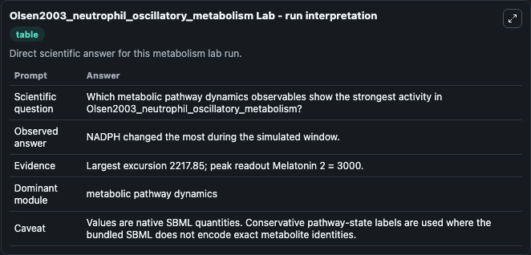
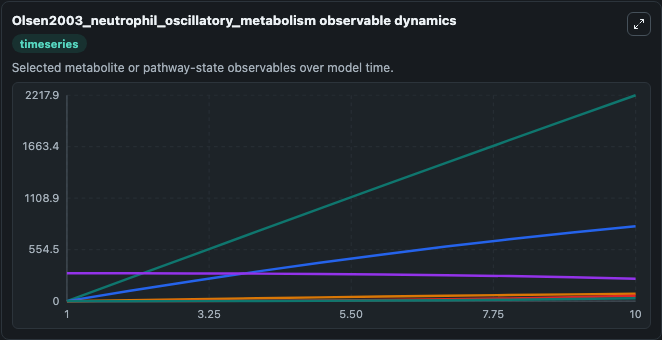
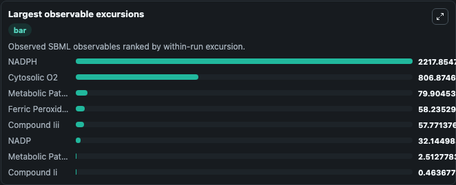
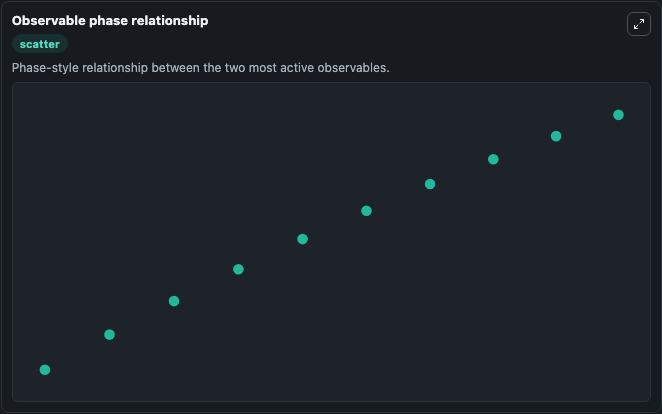

# Olsen2003_neutrophil_oscillatory_metabolism

Cleaned metabolism SBML ODE lab. The bundled SBML file remains the scientific source of truth.

Validation evidence: Tellurium loaded and simulated 20 floating species

## What You'll See

These dark-mode screenshots show the default Olsen2003_neutrophil_oscillatory_metabolism run over 10 model-time units with outputs sampled every 1. The lab exposes 5 inputs (`initial_h2o2`, `initial_ferric_peroxidase`, `initial_compound_i`, `initial_melatonin`, `initial_compound_ii`) and 8 outputs (`h2o2`, `ferric_peroxidase`, `compound_i`, `melatonin`, `compound_ii`, and 3 more). The default input state includes `initial_h2o2`=`0`, `initial_ferric_peroxidase`=`300`, `initial_compound_i`=`0`, `initial_melatonin`=`300`. Olsen2003_neutrophil_oscillatory_metabolism This model is described in the article: A model of the oscillatory metabolism of activated neutrophils. Olsen LF, Kummer U, Kindzelskii AL, Petty HR.

<!-- BIOSIMULANT_VISUALS_START -->
### Output Visualizations

The run interpretation table summarizes the configured Olsen2003_neutrophil_oscillatory_metabolism simulation and its reported output statistics.

The observable dynamics plot traces the main reported outputs over the captured run window, including `h2o2`, `ferric_peroxidase`, `compound_i`, `melatonin`, and 4 more.

The largest-observable-excursions chart ranks which reported variables moved the most during this simulation.

The phase-relationship plot compares paired observable values to show how the dominant trajectories move relative to one another.

<!-- BIOSIMULANT_VISUALS_END -->
