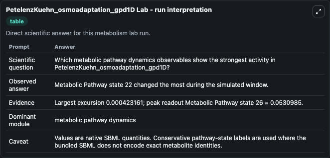
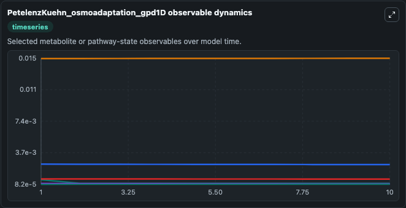
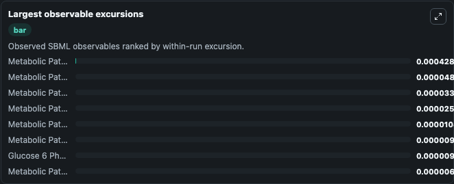
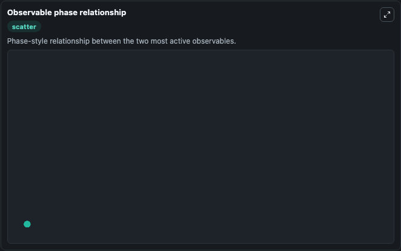

# PetelenzKuehn_osmoadaptation_gpd1D

Cleaned metabolism SBML ODE lab. The bundled SBML file remains the scientific source of truth.

Validation evidence: Tellurium loaded and simulated 29 floating species

## What You'll See

These dark-mode screenshots show the default PetelenzKuehn_osmoadaptation_gpd1D run over 10 model-time units with outputs sampled every 1. The lab exposes 5 inputs (`initial_metabolic_pathway_state_1`, `initial_metabolic_pathway_state_2`, `initial_metabolic_pathway_state_3`, `initial_glucose_6_phosphate`, `initial_metabolic_pathway_state_5`) and 8 outputs (`metabolic_pathway_state_1`, `metabolic_pathway_state_2`, `metabolic_pathway_state_3`, `glucose_6_phosphate`, `metabolic_pathway_state_5`, and 3 more). The default input state includes `initial_metabolic_pathway_state_1`=`0.112096`, `initial_metabolic_pathway_state_2`=`0.651922`, `initial_metabolic_pathway_state_3`=`2.77983`, `initial_glucose_6_phosphate`=`1.37587`. Petelenz-kurdzeil2013 - Osmo adaptationgpd1D This model is described in the article: Quantitative analysis of glycerol accumulation, glycolysis and growth under hyper osmotic stress. It can be used to explore metabolic flux dynamics and compare pathway behavior across conditions.

<!-- BIOSIMULANT_VISUALS_START -->
### Output Visualizations

The run interpretation table summarizes the configured PetelenzKuehn_osmoadaptation_gpd1D simulation and its reported output statistics.

The observable dynamics plot traces the main reported outputs over the captured run window, including `metabolic_pathway_state_1`, `metabolic_pathway_state_2`, `metabolic_pathway_state_3`, `glucose_6_phosphate`, and 4 more.

The largest-observable-excursions chart ranks which reported variables moved the most during this simulation.

The phase-relationship plot compares paired observable values to show how the dominant trajectories move relative to one another.

<!-- BIOSIMULANT_VISUALS_END -->
