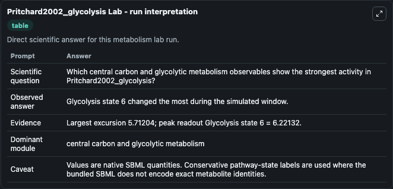
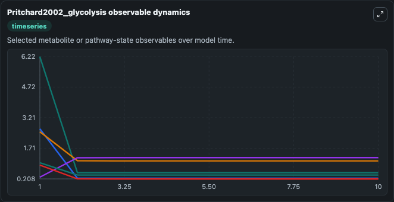
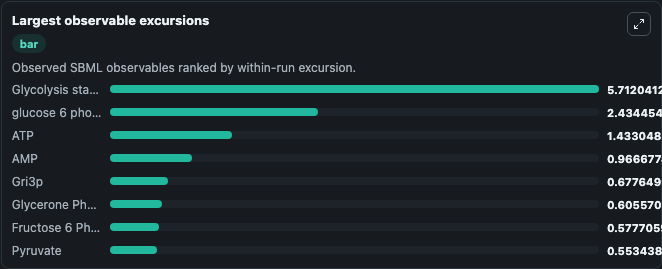
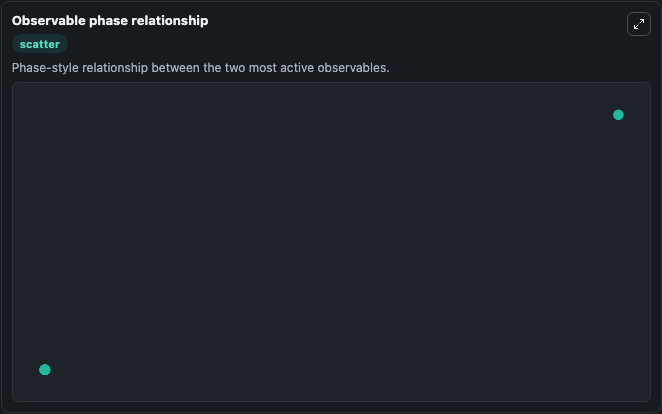

# Pritchard2002_glycolysis

Cleaned metabolism SBML ODE lab. The bundled SBML file remains the scientific source of truth.

Validation evidence: Tellurium loaded and simulated 17 floating species

## What You'll See

These dark-mode screenshots show the default Pritchard2002_glycolysis run over 10 model-time units with outputs sampled every 1. The lab exposes 5 inputs (`initial_intracellular_glucose`, `initial_atp`, `initial_glucose_6_phosphate`, `initial_adp`, `initial_fructose_6_phosphate`) and 8 outputs (`intracellular_glucose`, `atp`, `glucose_6_phosphate`, `adp`, `fructose_6_phosphate`, and 3 more). The default input state includes `initial_intracellular_glucose`=`0.097652231064563`, `initial_atp`=`2.52512746499271`, `initial_glucose_6_phosphate`=`2.67504014044787`, `initial_adp`=`1.28198768168719`. from: Schemes of fluc control in a model of Saccharomyces cerevisiae glycolysis Pritchard, L and Kell, DB Eur. It can be used to explore metabolic flux dynamics and compare pathway behavior across conditions.

<!-- BIOSIMULANT_VISUALS_START -->
### Output Visualizations

The run interpretation table summarizes the configured Pritchard2002_glycolysis simulation and its reported output statistics.

The observable dynamics plot traces the main reported outputs over the captured run window, including `intracellular_glucose`, `atp`, `glucose_6_phosphate`, `adp`, and 4 more.

The largest-observable-excursions chart ranks which reported variables moved the most during this simulation.

The phase-relationship plot compares paired observable values to show how the dominant trajectories move relative to one another.

<!-- BIOSIMULANT_VISUALS_END -->
