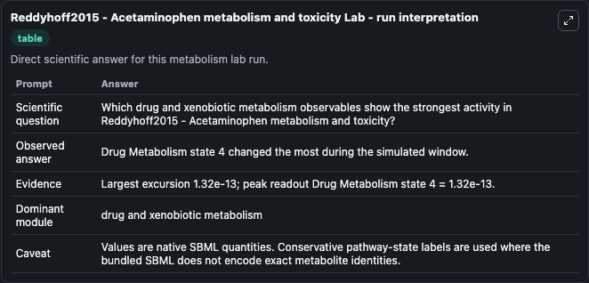
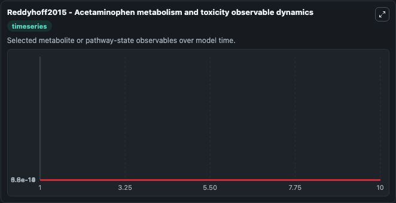
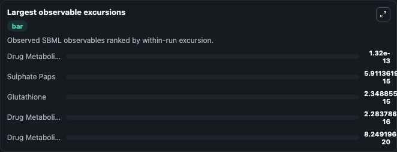
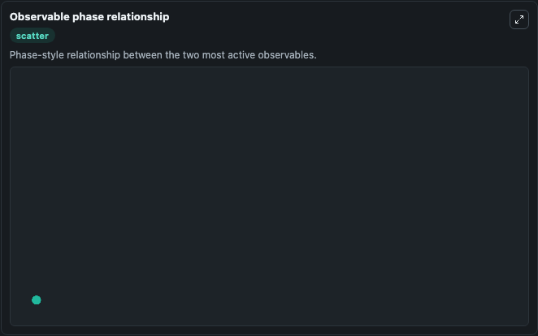

# Reddyhoff2015 - Acetaminophen metabolism and toxicity

Cleaned metabolism SBML ODE lab. The bundled SBML file remains the scientific source of truth.

Validation evidence: Tellurium loaded and simulated 5 floating species

## What You'll See

These dark-mode screenshots show the default Reddyhoff2015 - Acetaminophen metabolism and toxicity run over 10 model-time units with outputs sampled every 1. The lab exposes 5 inputs (`initial_sulphate_paps`, `initial_glutathione`, `initial_drug_metabolism_state_3`, `initial_drug_metabolism_state_4`, `initial_drug_metabolism_state_5`) and 8 outputs (`sulphate_paps`, `glutathione`, `drug_metabolism_state_3`, `drug_metabolism_state_4`, `drug_metabolism_state_5`, and 3 more). The default input state includes `initial_sulphate_paps`=`1.325e-14`, `initial_glutathione`=`6.87e-15`, `initial_drug_metabolism_state_3`=`0`, `initial_drug_metabolism_state_4`=`1.32e-13`. Reddyhoff2015 - Acetaminophen metabolism and toxicity This model examines acetaminophen metabolism and related hepatotoxicity. Multiple pathways associated with APAP metabolism has been included in th.

<!-- BIOSIMULANT_VISUALS_START -->
### Output Visualizations

The run interpretation table summarizes the configured Reddyhoff2015 - Acetaminophen metabolism and toxicity simulation and its reported output statistics.

The observable dynamics plot traces the main reported outputs over the captured run window, including `sulphate_paps`, `glutathione`, `drug_metabolism_state_3`, `drug_metabolism_state_4`, and 4 more.

The largest-observable-excursions chart ranks which reported variables moved the most during this simulation.

The phase-relationship plot compares paired observable values to show how the dominant trajectories move relative to one another.

<!-- BIOSIMULANT_VISUALS_END -->
