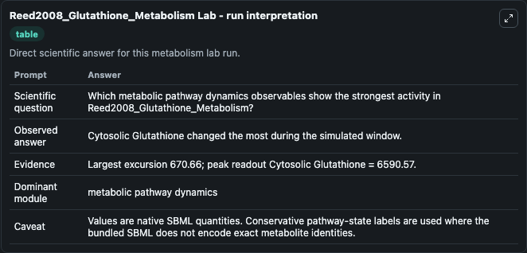
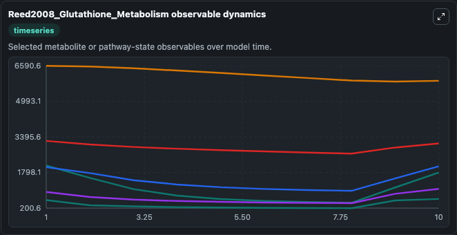
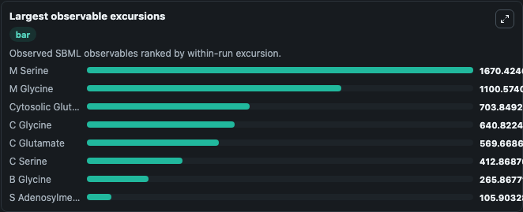
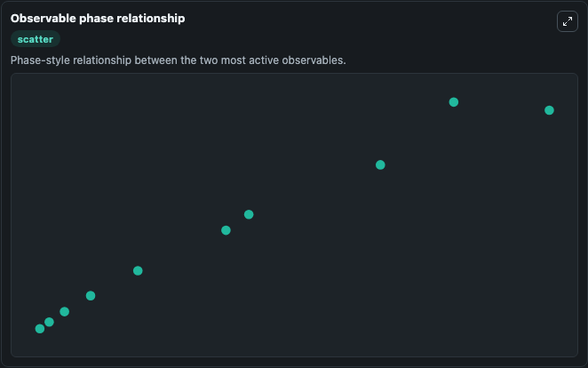

# Reed2008_Glutathione_Metabolism

Cleaned metabolism SBML ODE lab. The bundled SBML file remains the scientific source of truth.

Validation evidence: Tellurium loaded and simulated 34 floating species

## What You'll See

These dark-mode screenshots show the default Reed2008_Glutathione_Metabolism run over 10 model-time units with outputs sampled every 1. The lab exposes 5 inputs (`initial_cytosolic_tetrahydrofolate`, `initial_mitochondrial_tetrahydrofolate`, `initial_metabolic_pathway_state_3`, `initial_metabolic_pathway_state_4`, `initial_metabolic_pathway_state_5`) and 8 outputs (`cytosolic_tetrahydrofolate`, `mitochondrial_tetrahydrofolate`, `metabolic_pathway_state_3`, `metabolic_pathway_state_4`, `metabolic_pathway_state_5`, and 3 more). The default input state includes `initial_cytosolic_tetrahydrofolate`=`4.670919668857204`, `initial_mitochondrial_tetrahydrofolate`=`21.075801087262693`, `initial_metabolic_pathway_state_3`=`4.4965335653401`, `initial_metabolic_pathway_state_4`=`0.506278119133034`. This is the model described in the article: A mathematical model of glutathione metabolism. Michael C Reed, Rachel L Thomas, Jovana Pavisic, S.

<!-- BIOSIMULANT_VISUALS_START -->
### Output Visualizations

The run interpretation table summarizes the configured Reed2008_Glutathione_Metabolism simulation and its reported output statistics.

The observable dynamics plot traces the main reported outputs over the captured run window, including `cytosolic_tetrahydrofolate`, `mitochondrial_tetrahydrofolate`, `metabolic_pathway_state_3`, `metabolic_pathway_state_4`, and 4 more.

The largest-observable-excursions chart ranks which reported variables moved the most during this simulation.

The phase-relationship plot compares paired observable values to show how the dominant trajectories move relative to one another.

<!-- BIOSIMULANT_VISUALS_END -->
