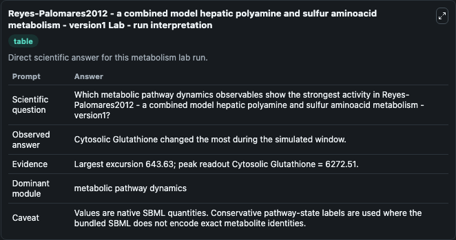
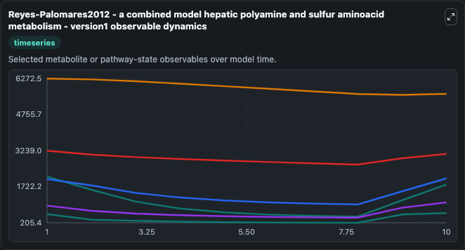
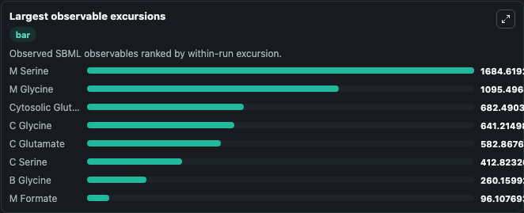
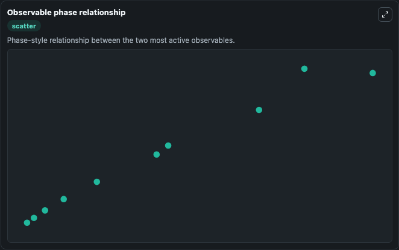

# Reyes-Palomares2012 - a combined model hepatic polyamine and sulfur aminoacid metabolism - version1

Cleaned metabolism SBML ODE lab. The bundled SBML file remains the scientific source of truth.

Validation evidence: Tellurium loaded and simulated 42 floating species

## What You'll See

These dark-mode screenshots show the default Reyes-Palomares2012 - a combined model hepatic polyamine and sulfur aminoacid metabolism - version1 run over 10 model-time units with outputs sampled every 1. The lab exposes 5 inputs (`initial_b_glycine`, `initial_b_glutamate`, `initial_b_cysteine`, `initial_metabolic_pathway_state_4`, `initial_blood_glutathione`) and 8 outputs (`b_glycine`, `b_glutamate`, `b_cysteine`, `metabolic_pathway_state_4`, `blood_glutathione`, and 3 more). The default input state includes `initial_b_glycine`=`218.733171504338`, `initial_b_glutamate`=`60.4651616225031`, `initial_b_cysteine`=`183.099466381356`, `initial_metabolic_pathway_state_4`=`0.472632922783833`. Reyes-Palomares2012 - a combined modelhepatic polyamine and sulfur aminoacid metabolism - version1 Mammalian polyamine metabolism consists of a bi-cycle with two required entrances, omithine and S-ade. It can be used to explore metabolic flux dynamics and compare pathway behavior across conditions.

<!-- BIOSIMULANT_VISUALS_START -->
### Output Visualizations

The run interpretation table summarizes the configured Reyes-Palomares2012 - a combined model hepatic polyamine and sulfur aminoacid metabolism - version1 simulation and its reported output statistics.

The observable dynamics plot traces the main reported outputs over the captured run window, including `b_glycine`, `b_glutamate`, `b_cysteine`, `metabolic_pathway_state_4`, and 4 more.

The largest-observable-excursions chart ranks which reported variables moved the most during this simulation.

The phase-relationship plot compares paired observable values to show how the dominant trajectories move relative to one another.

<!-- BIOSIMULANT_VISUALS_END -->
