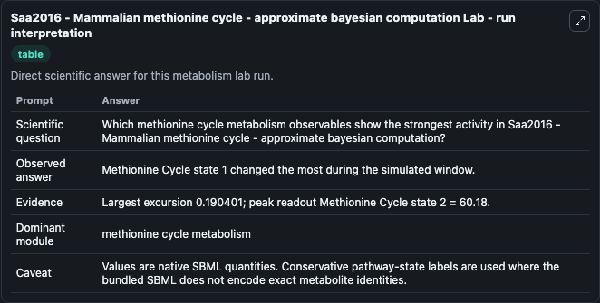
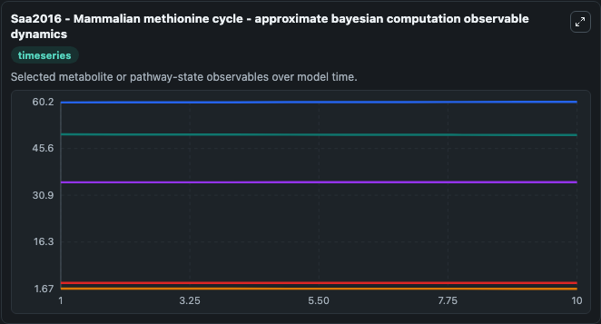
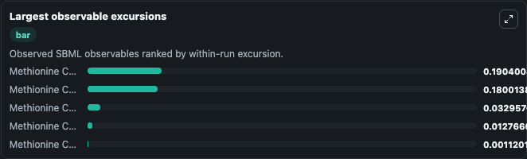
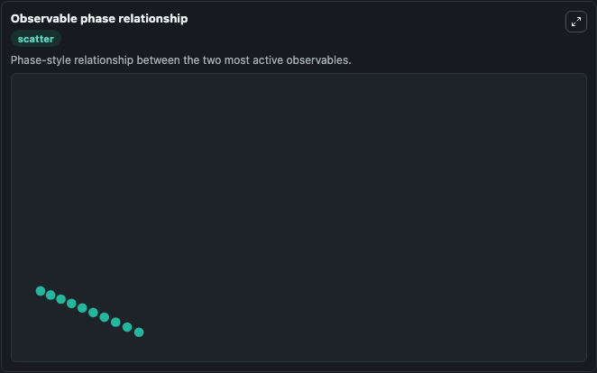

# Saa2016 - Mammalian methionine cycle - approximate bayesian computation

Cleaned metabolism SBML ODE lab. The bundled SBML file remains the scientific source of truth.

Validation evidence: Tellurium loaded and simulated 5 floating species

## What You'll See

These dark-mode screenshots show the default Saa2016 - Mammalian methionine cycle - approximate bayesian computation run over 10 model-time units with outputs sampled every 1. The lab exposes 5 inputs (`initial_methionine_cycle_state_1`, `initial_methionine_cycle_state_2`, `initial_methionine_cycle_state_3`, `initial_methionine_cycle_state_4`, `initial_methionine_cycle_state_5`) and 8 outputs (`methionine_cycle_state_1`, `methionine_cycle_state_2`, `methionine_cycle_state_3`, `methionine_cycle_state_4`, `methionine_cycle_state_5`, and 3 more). The default input state includes `initial_methionine_cycle_state_1`=`50`, `initial_methionine_cycle_state_2`=`60`, `initial_methionine_cycle_state_3`=`35`, `initial_methionine_cycle_state_4`=`1.7`. Construction of feasible and accurate kinetic models of metabolism: A Bayesian approachPedro A. It can be used to explore metabolic flux dynamics and compare pathway behavior across conditions.

<!-- BIOSIMULANT_VISUALS_START -->
### Output Visualizations

The run interpretation table summarizes the configured Saa2016 - Mammalian methionine cycle - approximate bayesian computation simulation and its reported output statistics.

The observable dynamics plot traces the main reported outputs over the captured run window, including `methionine_cycle_state_1`, `methionine_cycle_state_2`, `methionine_cycle_state_3`, `methionine_cycle_state_4`, and 4 more.

The largest-observable-excursions chart ranks which reported variables moved the most during this simulation.

The phase-relationship plot compares paired observable values to show how the dominant trajectories move relative to one another.

<!-- BIOSIMULANT_VISUALS_END -->
