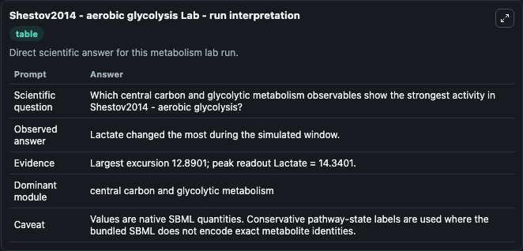
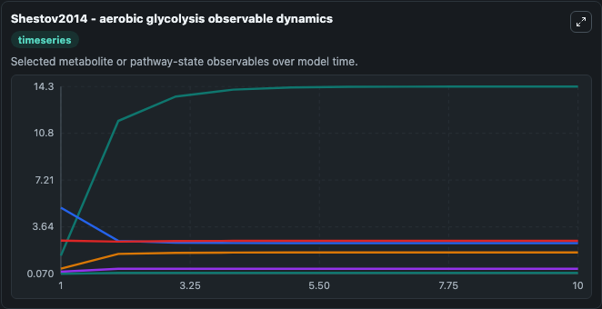
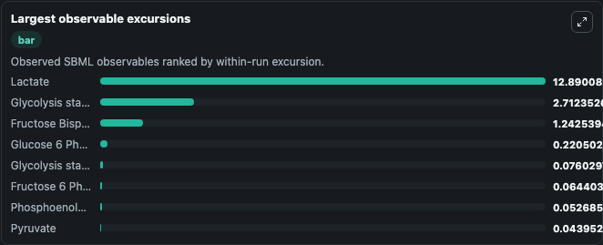
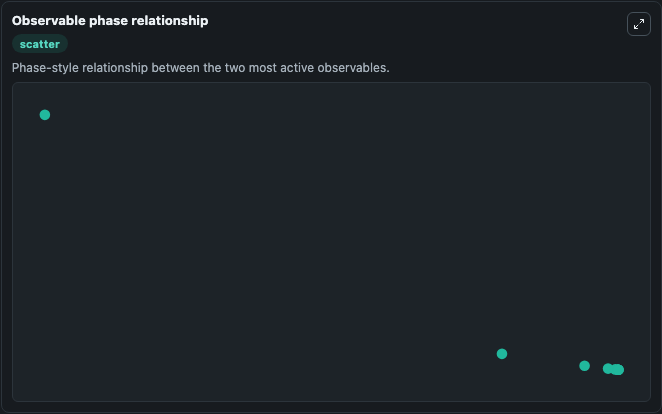

# Shestov2014 - aerobic glycolysis

Cleaned metabolism SBML ODE lab. The bundled SBML file remains the scientific source of truth.

Validation evidence: Tellurium loaded and simulated 21 floating species

## What You'll See

These dark-mode screenshots show the default Shestov2014 - aerobic glycolysis run over 10 model-time units with outputs sampled every 1. The lab exposes 5 inputs (`initial_glycolysis_state_1`, `initial_glucose_6_phosphate`, `initial_fructose_6_phosphate`, `initial_fructose_bisphosphate`, `initial_glycolysis_state_5`) and 8 outputs (`glycolysis_state_1`, `glucose_6_phosphate`, `fructose_6_phosphate`, `fructose_bisphosphate`, `glycolysis_state_5`, and 3 more). The default input state includes `initial_glycolysis_state_1`=`2.5909`, `initial_glucose_6_phosphate`=`0.2263`, `initial_fructose_6_phosphate`=`0.0701`, `initial_fructose_bisphosphate`=`0.45`. Metabolism Shestov2014Aerobic Glycolysis Model1504010000Model models metabolism shestov2014 aerobic glycolysis model1504010000 dynamics as a OTHER simulation curated from biomodels_ebi (biomodels_ebi:MODEL15040. When you run it, you can track state over time and compare response patterns across parameter settings.

<!-- BIOSIMULANT_VISUALS_START -->
### Output Visualizations

The run interpretation table summarizes the configured Shestov2014 - aerobic glycolysis simulation and its reported output statistics.

The observable dynamics plot traces the main reported outputs over the captured run window, including `glycolysis_state_1`, `glucose_6_phosphate`, `fructose_6_phosphate`, `fructose_bisphosphate`, and 4 more.

The largest-observable-excursions chart ranks which reported variables moved the most during this simulation.

The phase-relationship plot compares paired observable values to show how the dominant trajectories move relative to one another.

<!-- BIOSIMULANT_VISUALS_END -->
