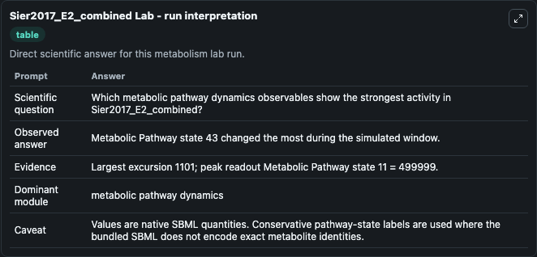
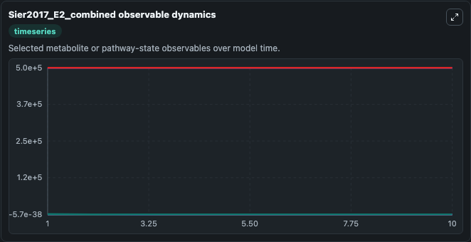
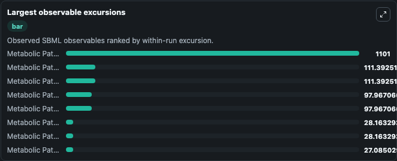
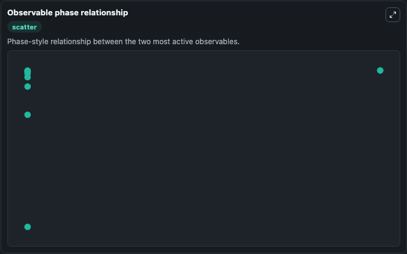

# Sier2017_E2_combined

Cleaned metabolism SBML ODE lab. The bundled SBML file remains the scientific source of truth.

Validation evidence: Tellurium loaded and simulated 46 floating species

## What You'll See

These dark-mode screenshots show the default Sier2017_E2_combined run over 10 model-time units with outputs sampled every 1. The lab exposes 5 inputs (`initial_metabolic_pathway_state_1`, `initial_metabolic_pathway_state_2`, `initial_metabolic_pathway_state_3`, `initial_metabolic_pathway_state_4`, `initial_metabolic_pathway_state_5`) and 8 outputs (`metabolic_pathway_state_1`, `metabolic_pathway_state_2`, `metabolic_pathway_state_3`, `metabolic_pathway_state_4`, `metabolic_pathway_state_5`, and 3 more). The default input state includes `initial_metabolic_pathway_state_1`=`1`, `initial_metabolic_pathway_state_2`=`3001.00000000002`, `initial_metabolic_pathway_state_3`=`-2999.00000000002`, `initial_metabolic_pathway_state_4`=`0.0209437464725829`. Using scaling from PhysB modelBlood flow in L/hrCompartments in KgBaseline as ~0.003nM Free E2 in Blood_venous E2 biosynthesis rate constant = 2 E2 biosynthesis species = 1nMCLeh = 5CLint = metabolic. It can be used to explore metabolic flux dynamics and compare pathway behavior across conditions.

<!-- BIOSIMULANT_VISUALS_START -->
### Output Visualizations

The run interpretation table summarizes the configured Sier2017_E2_combined simulation and its reported output statistics.

The observable dynamics plot traces the main reported outputs over the captured run window, including `metabolic_pathway_state_1`, `metabolic_pathway_state_2`, `metabolic_pathway_state_3`, `metabolic_pathway_state_4`, and 4 more.

The largest-observable-excursions chart ranks which reported variables moved the most during this simulation.

The phase-relationship plot compares paired observable values to show how the dominant trajectories move relative to one another.

<!-- BIOSIMULANT_VISUALS_END -->
