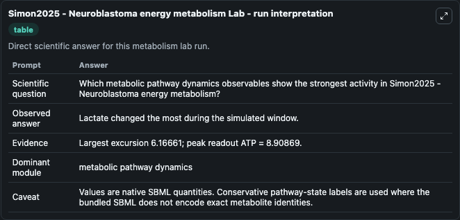
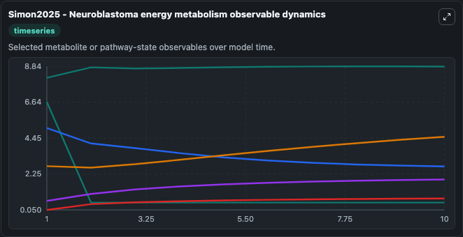
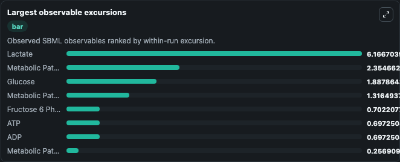
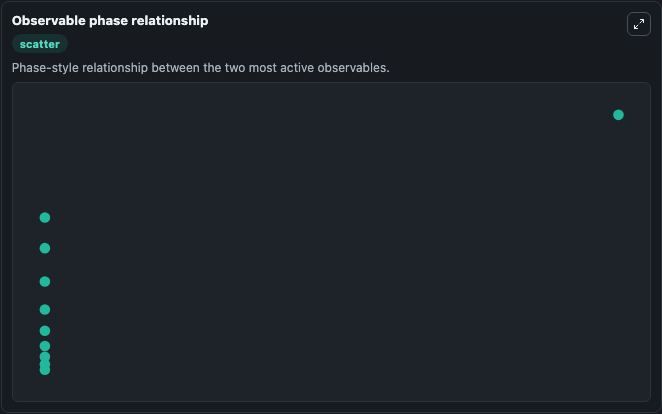

# Simon2025 - Neuroblastoma energy metabolism

Cleaned metabolism SBML ODE lab. The bundled SBML file remains the scientific source of truth.

Validation evidence: Tellurium loaded and simulated 19 floating species

## What You'll See

These dark-mode screenshots show the default Simon2025 - Neuroblastoma energy metabolism run over 10 model-time units with outputs sampled every 1. The lab exposes 5 inputs (`initial_glucose`, `initial_adp`, `initial_atp`, `initial_metabolic_pathway_state_4`, `initial_fructose_6_phosphate`) and 8 outputs (`glucose`, `adp`, `atp`, `metabolic_pathway_state_4`, `fructose_6_phosphate`, and 3 more). The default input state includes `initial_glucose`=`2.72988078351158`, `initial_adp`=`4.79944686874058`, `initial_atp`=`8.14466765495666`, `initial_metabolic_pathway_state_4`=`0.601679350245062`. Metabolism Simon2025Neuroblastoma Energy Metabolism Model2502190001Model models core biological dynamics as a OTHER simulation curated from biomodels_ebi (biomodels_ebi:MODEL2502190001), focused on metabolism. When you run it, you can track state over time and compare response patterns across parameter settings.

<!-- BIOSIMULANT_VISUALS_START -->
### Output Visualizations

The run interpretation table summarizes the configured Simon2025 - Neuroblastoma energy metabolism simulation and its reported output statistics.

The observable dynamics plot traces the main reported outputs over the captured run window, including `glucose`, `adp`, `atp`, `metabolic_pathway_state_4`, and 4 more.

The largest-observable-excursions chart ranks which reported variables moved the most during this simulation.

The phase-relationship plot compares paired observable values to show how the dominant trajectories move relative to one another.

<!-- BIOSIMULANT_VISUALS_END -->
