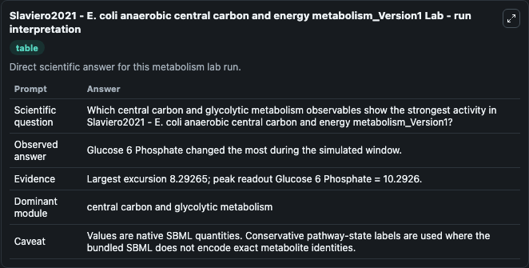
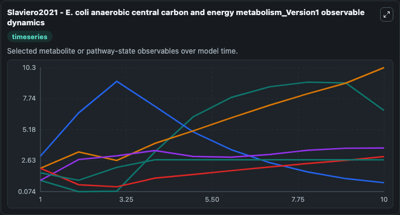
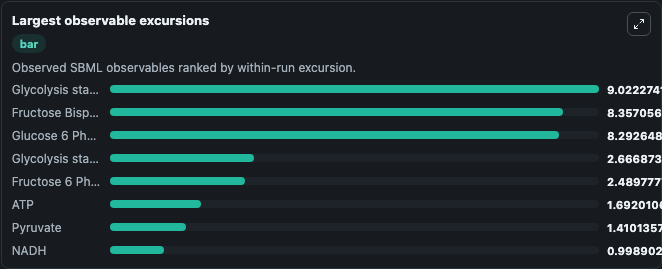
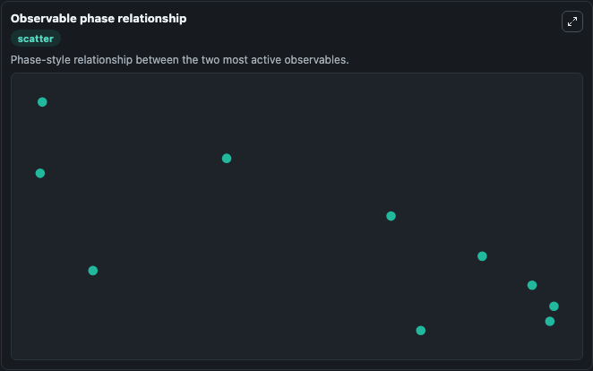

# Slaviero2021 - E. coli anaerobic central carbon and energy metabolism_Version1

Cleaned metabolism SBML ODE lab. The bundled SBML file remains the scientific source of truth.

Validation evidence: Tellurium loaded and simulated 27 floating species

## What You'll See

These dark-mode screenshots show the default Slaviero2021 - E. coli anaerobic central carbon and energy metabolism_Version1 run over 10 model-time units with outputs sampled every 1. The lab exposes 5 inputs (`initial_glucose_6_phosphate`, `initial_fructose_bisphosphate`, `initial_glyceraldehyde_3_phosphate`, `initial_phosphoenolpyruvate`, `initial_pyruvate`) and 8 outputs (`glucose_6_phosphate`, `fructose_bisphosphate`, `glyceraldehyde_3_phosphate`, `phosphoenolpyruvate`, `pyruvate`, and 3 more). The default input state includes `initial_glucose_6_phosphate`=`2`, `initial_fructose_bisphosphate`=`3`, `initial_glyceraldehyde_3_phosphate`=`0.5`, `initial_phosphoenolpyruvate`=`1`. This model describes the central carbon and energy metabolism of E. coli growing under anaerobic conditions.For complete information about the model see: 'Deciphering the physiological response of Esc.

<!-- BIOSIMULANT_VISUALS_START -->
### Output Visualizations

The run interpretation table summarizes the configured Slaviero2021 - E. coli anaerobic central carbon and energy metabolism_Version1 simulation and its reported output statistics.

The observable dynamics plot traces the main reported outputs over the captured run window, including `glucose_6_phosphate`, `fructose_bisphosphate`, `glyceraldehyde_3_phosphate`, `phosphoenolpyruvate`, and 4 more.

The largest-observable-excursions chart ranks which reported variables moved the most during this simulation.

The phase-relationship plot compares paired observable values to show how the dominant trajectories move relative to one another.

<!-- BIOSIMULANT_VISUALS_END -->
