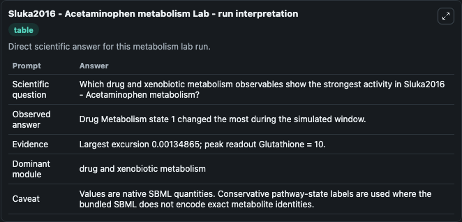
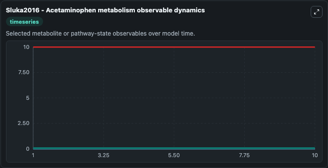
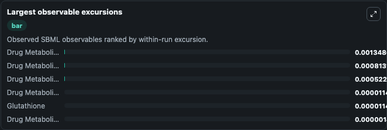
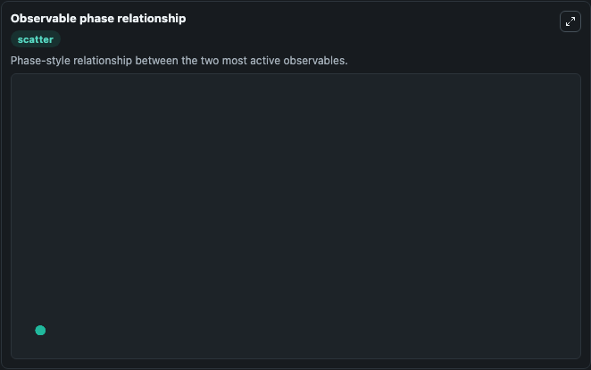

# Sluka2016 - Acetaminophen metabolism

Cleaned metabolism SBML ODE lab. The bundled SBML file remains the scientific source of truth.

Validation evidence: Tellurium loaded and simulated 6 floating species

## What You'll See

These dark-mode screenshots show the default Sluka2016 - Acetaminophen metabolism run over 10 model-time units with outputs sampled every 1. The lab exposes 5 inputs (`initial_drug_metabolism_state_1`, `initial_drug_metabolism_state_2`, `initial_glutathione`, `initial_drug_metabolism_state_4`, `initial_drug_metabolism_state_5`) and 8 outputs (`drug_metabolism_state_1`, `drug_metabolism_state_2`, `glutathione`, `drug_metabolism_state_4`, `drug_metabolism_state_5`, and 3 more). The default input state includes `initial_drug_metabolism_state_1`=`0.1`, `initial_drug_metabolism_state_2`=`0`, `initial_glutathione`=`10`, `initial_drug_metabolism_state_4`=`0`. Sluka2016 - Acetaminophen metabolism Liver metabolism of Acetaminophen: Acetaminophen (APAP) ismetabolized in the liver in both Phase I and Phase II reactions.Phase II reactions convert APAP to APAP-g. It can be used to explore metabolic flux dynamics and compare pathway behavior across conditions.

<!-- BIOSIMULANT_VISUALS_START -->
### Output Visualizations

The run interpretation table summarizes the configured Sluka2016 - Acetaminophen metabolism simulation and its reported output statistics.

The observable dynamics plot traces the main reported outputs over the captured run window, including `drug_metabolism_state_1`, `drug_metabolism_state_2`, `glutathione`, `drug_metabolism_state_4`, and 4 more.

The largest-observable-excursions chart ranks which reported variables moved the most during this simulation.

The phase-relationship plot compares paired observable values to show how the dominant trajectories move relative to one another.

<!-- BIOSIMULANT_VISUALS_END -->
