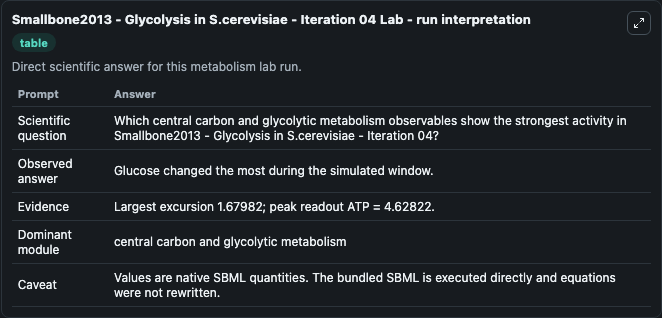
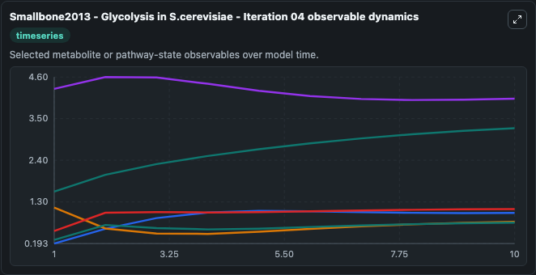
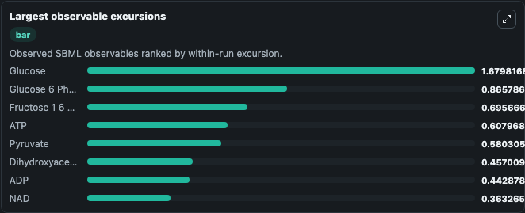
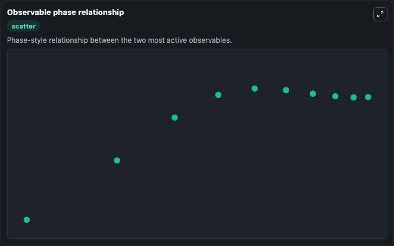

# Smallbone2013 - Glycolysis in S.cerevisiae - Iteration 04

Cleaned metabolism SBML ODE lab. The bundled SBML file remains the scientific source of truth.

Validation evidence: Tellurium loaded and simulated 16 floating species

## What You'll See

These dark-mode screenshots show the default Smallbone2013 - Glycolysis in S.cerevisiae - Iteration 04 run over 10 model-time units with outputs sampled every 1. The lab exposes 5 inputs (`initial_adp`, `initial_atp`, `initial_acetaldehyde`, `initial_observable_1_3_bisphosphoglycerate`, `initial_dihydroxyacetone_phosphate`) and 8 outputs (`adp`, `atp`, `acetaldehyde`, `observable_1_3_bisphosphoglycerate`, `dihydroxyacetone_phosphate`, and 3 more). The default input state includes `initial_adp`=`1.29`, `initial_atp`=`4.29`, `initial_acetaldehyde`=`0.178140579850657`, `initial_observable_1_3_bisphosphoglycerate`=`0.000736873499865602`. Smallbone2013 - Glycolysis in S.cerevisiae - Iteration 04 This model is described in the article: A model of yeast glycolysis based on a consistent kinetic characterization of all its enzymes Kieran S. It can be used to explore metabolic flux dynamics and compare pathway behavior across conditions.

<!-- BIOSIMULANT_VISUALS_START -->
### Output Visualizations

The run interpretation table summarizes the configured Smallbone2013 - Glycolysis in S.cerevisiae - Iteration 04 simulation and its reported output statistics.

The observable dynamics plot traces the main reported outputs over the captured run window, including `adp`, `atp`, `acetaldehyde`, `observable_1_3_bisphosphoglycerate`, and 4 more.

The largest-observable-excursions chart ranks which reported variables moved the most during this simulation.

The phase-relationship plot compares paired observable values to show how the dominant trajectories move relative to one another.

<!-- BIOSIMULANT_VISUALS_END -->
