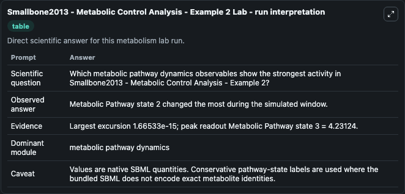
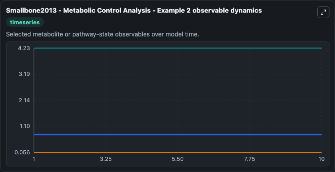
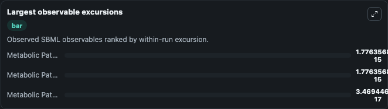

# Smallbone2013 - Metabolic Control Analysis - Example 2

Cleaned metabolism SBML ODE lab. The bundled SBML file remains the scientific source of truth.

Validation evidence: Tellurium loaded and simulated 3 floating species

## What You'll See

These dark-mode screenshots show the default Smallbone2013 - Metabolic Control Analysis - Example 2 run over 10 model-time units with outputs sampled every 1. The lab exposes 3 inputs (`initial_metabolic_pathway_state_1`, `initial_metabolic_pathway_state_2`, `initial_metabolic_pathway_state_3`) and 6 outputs (`metabolic_pathway_state_1`, `metabolic_pathway_state_2`, `metabolic_pathway_state_3`, `observable_values`, `run_summary`, and 1 more). The default input state includes `initial_metabolic_pathway_state_1`=`0.05625738310526`, `initial_metabolic_pathway_state_2`=`0.76876151899652`, `initial_metabolic_pathway_state_3`=`4.23123848100348`. Smallbone2013 - Metabolic Control Analysis - Example 2 Metabolic control analysis (MCA) is a biochemical formalism, defining how variables, such as fluxes and concentrations, depend on network paramet. It can be used to explore metabolic flux dynamics and compare pathway behavior across conditions.

<!-- BIOSIMULANT_VISUALS_START -->
### Output Visualizations

The run interpretation table summarizes the configured Smallbone2013 - Metabolic Control Analysis - Example 2 simulation and its reported output statistics.

The observable dynamics plot traces the main reported outputs over the captured run window, including `metabolic_pathway_state_1`, `metabolic_pathway_state_2`, `metabolic_pathway_state_3`, `observable_values`, and 2 more.

The largest-observable-excursions chart ranks which reported variables moved the most during this simulation.

The phase-relationship plot compares paired observable values to show how the dominant trajectories move relative to one another.

<!-- BIOSIMULANT_VISUALS_END -->
