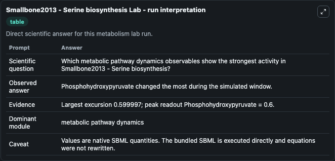
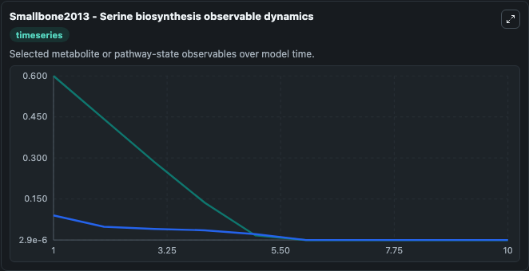
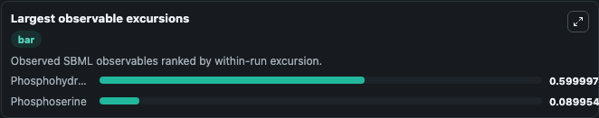
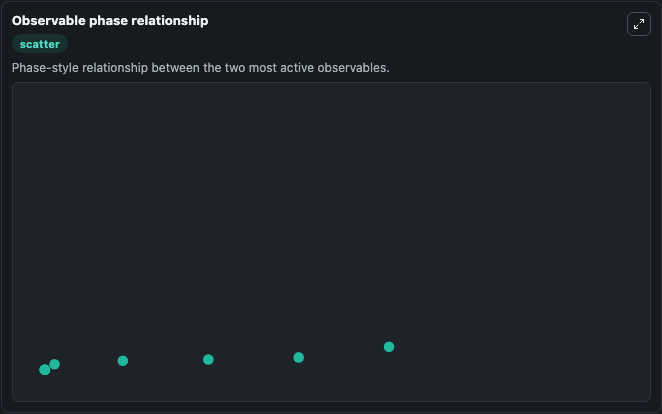

# Smallbone2013 - Serine biosynthesis

Cleaned metabolism SBML ODE lab. The bundled SBML file remains the scientific source of truth.

Validation evidence: Tellurium loaded and simulated 2 floating species

## What You'll See

These dark-mode screenshots show the default Smallbone2013 - Serine biosynthesis run over 10 model-time units with outputs sampled every 1. The lab exposes 2 inputs (`initial_phosphohydroxypyruvate`, `initial_phosphoserine`) and 5 outputs (`phosphohydroxypyruvate`, `phosphoserine`, `observable_values`, `run_summary`, `observable_labels`). The default input state includes `initial_phosphohydroxypyruvate`=`0.6`, `initial_phosphoserine`=`0.09`. Smallbone2013 - Serine biosynthesis Kinetic modelling of metabolic pathways in application to Serine biosynthesis. This model is described in the article: Kinetic Modeling of Metabolic Pathways: Appli.

<!-- BIOSIMULANT_VISUALS_START -->
### Output Visualizations

The run interpretation table summarizes the configured Smallbone2013 - Serine biosynthesis simulation and its reported output statistics.

The observable dynamics plot traces the main reported outputs over the captured run window, including `phosphohydroxypyruvate`, `phosphoserine`, `observable_values`, `run_summary`, and 1 more.

The largest-observable-excursions chart ranks which reported variables moved the most during this simulation.

The phase-relationship plot compares paired observable values to show how the dominant trajectories move relative to one another.

<!-- BIOSIMULANT_VISUALS_END -->
