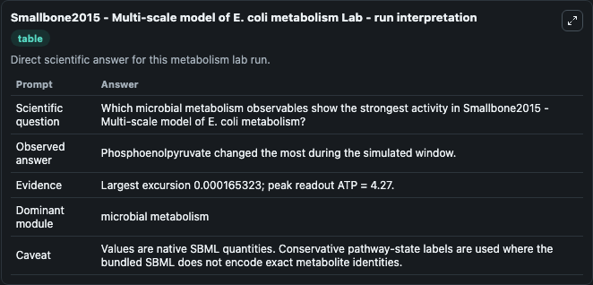
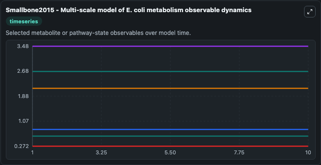
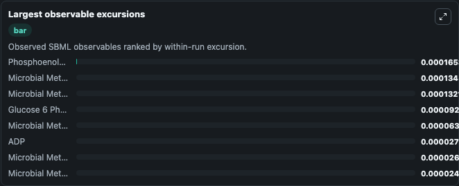
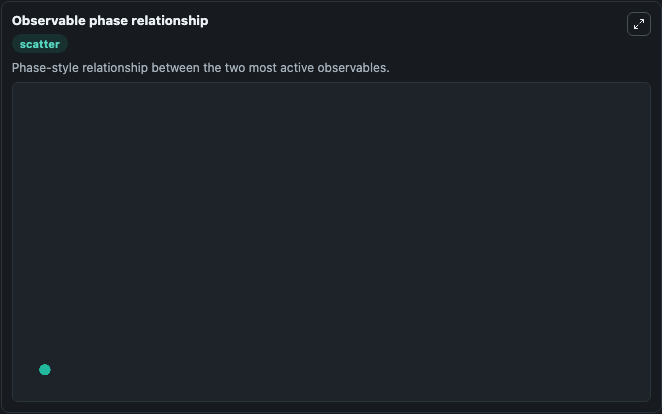

# Smallbone2015 - Multi-scale model of E. coli metabolism

Cleaned metabolism SBML ODE lab. The bundled SBML file remains the scientific source of truth.

Validation evidence: Tellurium loaded and simulated 144 floating species

## What You'll See

These dark-mode screenshots show the default Smallbone2015 - Multi-scale model of E. coli metabolism run over 10 model-time units with outputs sampled every 1. The lab exposes 5 inputs (`initial_phosphoenolpyruvate`, `initial_glucose_6_phosphate`, `initial_pyruvate`, `initial_fructose_6_phosphate`, `initial_microbial_metabolism_state_5`) and 8 outputs (`phosphoenolpyruvate`, `glucose_6_phosphate`, `pyruvate`, `fructose_6_phosphate`, `microbial_metabolism_state_5`, and 3 more). The default input state includes `initial_phosphoenolpyruvate`=`2.67`, `initial_glucose_6_phosphate`=`3.48`, `initial_pyruvate`=`2.67`, `initial_fructose_6_phosphate`=`0.6`. Metabolism Smallbone2015Multi Scale Model Of EColi Metabo Model1503050000Model captures core biological behavior in the context of metabolism, sbml, biomodels_ebi using a biomodels_ebi-sourced OTHER model. When you run it, you can observe state and evaluate how the modeled system changes across runs.

<!-- BIOSIMULANT_VISUALS_START -->
### Output Visualizations

The run interpretation table summarizes the configured Smallbone2015 - Multi-scale model of E. coli metabolism simulation and its reported output statistics.

The observable dynamics plot traces the main reported outputs over the captured run window, including `phosphoenolpyruvate`, `glucose_6_phosphate`, `pyruvate`, `fructose_6_phosphate`, and 4 more.

The largest-observable-excursions chart ranks which reported variables moved the most during this simulation.

The phase-relationship plot compares paired observable values to show how the dominant trajectories move relative to one another.

<!-- BIOSIMULANT_VISUALS_END -->
