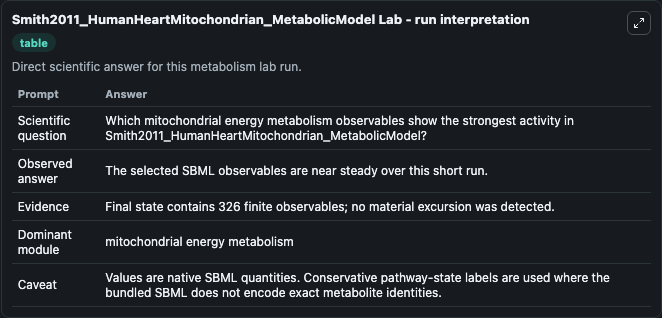
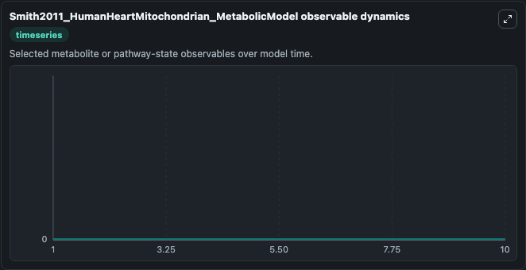
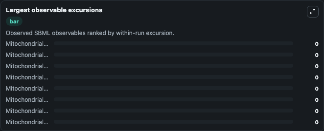

# Smith2011_HumanHeartMitochondrian_MetabolicModel

Cleaned metabolism SBML ODE lab. The bundled SBML file remains the scientific source of truth.

Validation evidence: Tellurium loaded and simulated 326 floating species

## What You'll See

These dark-mode screenshots show the default Smith2011_HumanHeartMitochondrian_MetabolicModel run over 10 model-time units with outputs sampled every 1. The lab exposes 5 inputs (`initial_c00000cyto_biomass`, `initial_c00001cyto_h2o`, `initial_c00002cyto_atp`, `initial_c00003cyto_nad`, `initial_c00004cyto_nadh`) and 8 outputs (`c00000cyto_biomass`, `c00001cyto_h2o`, `c00002cyto_atp`, `c00003cyto_nad`, `c00004cyto_nadh`, and 3 more). The default input state includes `initial_c00000cyto_biomass`=`0`, `initial_c00001cyto_h2o`=`0`, `initial_c00002cyto_atp`=`0`, `initial_c00003cyto_nad`=`0`. This model is from the article: A metabolic model of the mitochondrion and its use in modelling diseases of the tricarboxylic acid cycle. It can be used to explore metabolic flux dynamics and compare pathway behavior across conditions.

<!-- BIOSIMULANT_VISUALS_START -->
### Output Visualizations

The run interpretation table summarizes the configured Smith2011_HumanHeartMitochondrian_MetabolicModel simulation and its reported output statistics.

The observable dynamics plot traces the main reported outputs over the captured run window, including `c00000cyto_biomass`, `c00001cyto_h2o`, `c00002cyto_atp`, `c00003cyto_nad`, and 4 more.

The largest-observable-excursions chart ranks which reported variables moved the most during this simulation.

The phase-relationship plot compares paired observable values to show how the dominant trajectories move relative to one another.

<!-- BIOSIMULANT_VISUALS_END -->
