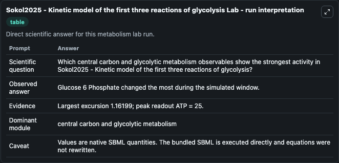
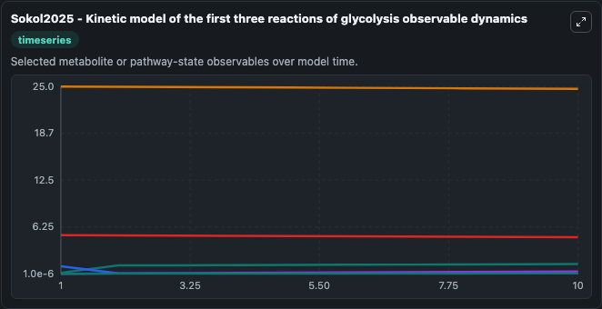
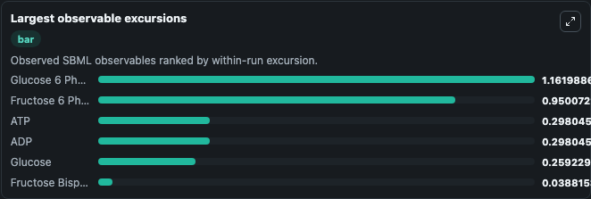
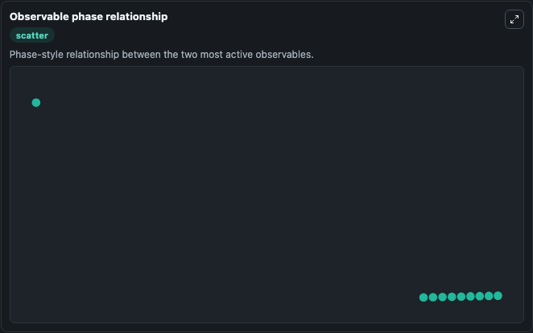

# Sokol2025 - Kinetic model of the first three reactions of glycolysis

Cleaned metabolism SBML ODE lab. The bundled SBML file remains the scientific source of truth.

Validation evidence: Tellurium loaded and simulated 6 floating species

## What You'll See

These dark-mode screenshots show the default Sokol2025 - Kinetic model of the first three reactions of glycolysis run over 10 model-time units with outputs sampled every 1. The lab exposes 5 inputs (`initial_adp`, `initial_atp`, `initial_glucose_6_phosphate`, `initial_glucose`, `initial_fructose_6_phosphate`) and 8 outputs (`adp`, `atp`, `glucose_6_phosphate`, `glucose`, `fructose_6_phosphate`, and 3 more). The default input state includes `initial_adp`=`0.00000102876420481711`, `initial_atp`=`24.9999838070557`, `initial_glucose_6_phosphate`=`0.125387382474129`, `initial_glucose`=`5.1381410880857`. Kinetic model of the first three reactions of glycolysis. It can be used to explore metabolic flux dynamics and compare pathway behavior across conditions.

<!-- BIOSIMULANT_VISUALS_START -->
### Output Visualizations

The run interpretation table summarizes the configured Sokol2025 - Kinetic model of the first three reactions of glycolysis simulation and its reported output statistics.

The observable dynamics plot traces the main reported outputs over the captured run window, including `adp`, `atp`, `glucose_6_phosphate`, `glucose`, and 4 more.

The largest-observable-excursions chart ranks which reported variables moved the most during this simulation.

The phase-relationship plot compares paired observable values to show how the dominant trajectories move relative to one another.

<!-- BIOSIMULANT_VISUALS_END -->
