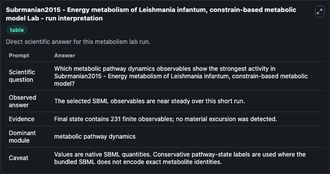
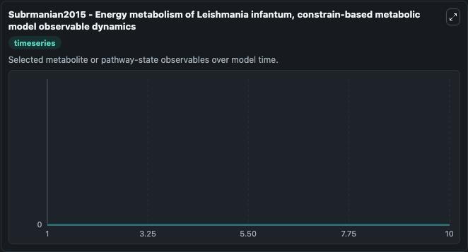
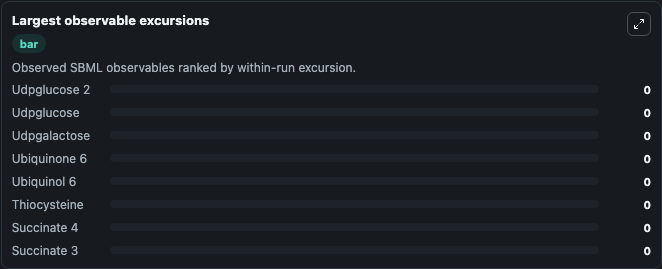
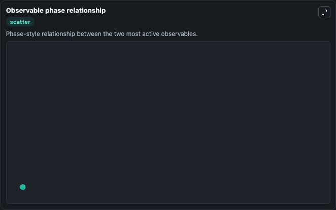

# Subrmanian2015 - Energy metabolism of Leishmania infantum, constrain-based metabolic model

Cleaned metabolism SBML ODE lab. The bundled SBML file remains the scientific source of truth.

Validation evidence: Tellurium loaded and simulated 231 floating species

## What You'll See

These dark-mode screenshots show the default Subrmanian2015 - Energy metabolism of Leishmania infantum, constrain-based metabolic model run over 10 model-time units with outputs sampled every 1. The lab exposes 5 inputs (`initial_observable_3_phospho_d_glyceroyl_phosphate`, `initial_observable_3_phospho_d_glyceroyl_phosphate_2`, `initial_observable_3_phospho_d_glycerate`, `initial_observable_3_phospho_d_glycerate_2`, `initial_observable_6_phospho_d_gluconate`) and 8 outputs (`observable_3_phospho_d_glyceroyl_phosphate`, `observable_3_phospho_d_glyceroyl_phosphate_2`, `observable_3_phospho_d_glycerate`, `observable_3_phospho_d_glycerate_2`, `observable_6_phospho_d_gluconate`, and 3 more). The default input state includes `initial_observable_3_phospho_d_glyceroyl_phosphate`=`0`, `initial_observable_3_phospho_d_glyceroyl_phosphate_2`=`0`, `initial_observable_3_phospho_d_glycerate`=`0`, `initial_observable_3_phospho_d_glycerate_2`=`0`. The uploaded model is linked to the PLoS ONE article: Subramanian A, Jhawar J, Sarkar RR (2015) Dissecting Leishmania infantum Energy Metabolism - A Systems Perspective. It can be used to explore metabolic flux dynamics and compare pathway behavior across conditions.

<!-- BIOSIMULANT_VISUALS_START -->
### Output Visualizations

The run interpretation table summarizes the configured Subrmanian2015 - Energy metabolism of Leishmania infantum, constrain-based metabolic model simulation and its reported output statistics.

The observable dynamics plot traces the main reported outputs over the captured run window, including `observable_3_phospho_d_glyceroyl_phosphate`, `observable_3_phospho_d_glyceroyl_phosphate_2`, `observable_3_phospho_d_glycerate`, `observable_3_phospho_d_glycerate_2`, and 4 more.

The largest-observable-excursions chart ranks which reported variables moved the most during this simulation.

The phase-relationship plot compares paired observable values to show how the dominant trajectories move relative to one another.

<!-- BIOSIMULANT_VISUALS_END -->
