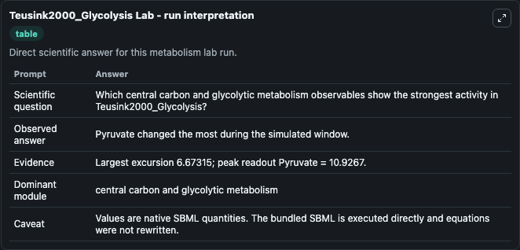
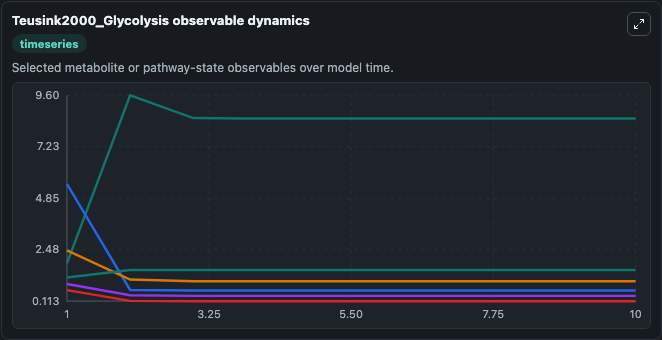
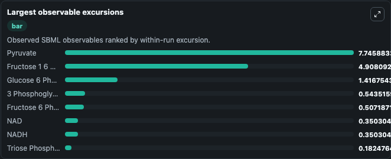
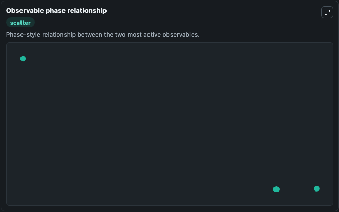

# Teusink2000_Glycolysis

Cleaned metabolism SBML ODE lab. The bundled SBML file remains the scientific source of truth.

Validation evidence: Tellurium loaded and simulated 19 floating species

## What You'll See

These dark-mode screenshots show the default Teusink2000_Glycolysis run over 10 model-time units with outputs sampled every 1. The lab exposes 5 inputs (`initial_glucose_in_cytosol`, `initial_glucose_6_phosphate`, `initial_fructose_6_phosphate`, `initial_fructose_1_6_bisphosphate`, `initial_triose_phosphate`) and 8 outputs (`glucose_in_cytosol`, `glucose_6_phosphate`, `fructose_6_phosphate`, `fructose_1_6_bisphosphate`, `triose_phosphate`, and 3 more). The default input state includes `initial_glucose_in_cytosol`=`0.087`, `initial_glucose_6_phosphate`=`2.45`, `initial_fructose_6_phosphate`=`0.62`, `initial_fructose_1_6_bisphosphate`=`5.51`. Can yeast glycolysis be understood in terms of in vitro kinetics of the constituent enzymes? It can be used to explore metabolic flux dynamics and compare pathway behavior across conditions.

<!-- BIOSIMULANT_VISUALS_START -->
### Output Visualizations

The run interpretation table summarizes the configured Teusink2000_Glycolysis simulation and its reported output statistics.

The observable dynamics plot traces the main reported outputs over the captured run window, including `glucose_in_cytosol`, `glucose_6_phosphate`, `fructose_6_phosphate`, `fructose_1_6_bisphosphate`, and 4 more.

The largest-observable-excursions chart ranks which reported variables moved the most during this simulation.

The phase-relationship plot compares paired observable values to show how the dominant trajectories move relative to one another.

<!-- BIOSIMULANT_VISUALS_END -->
