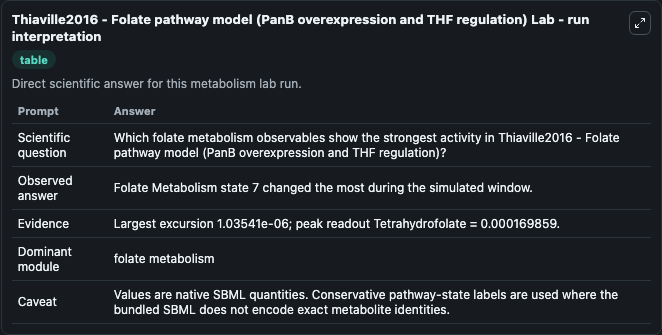
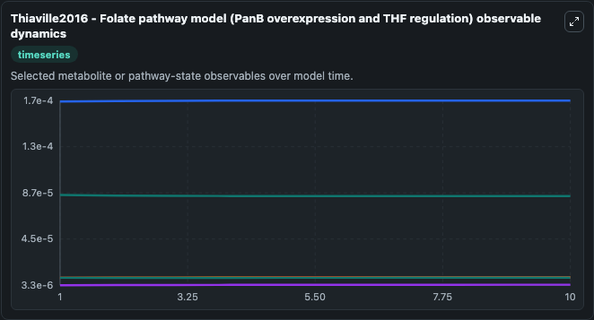
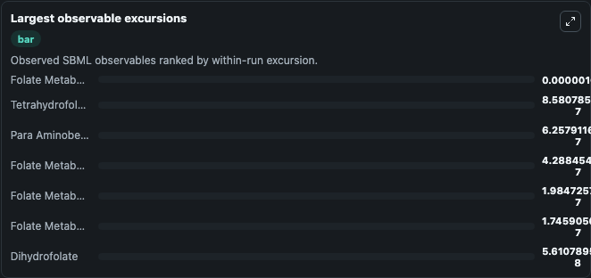
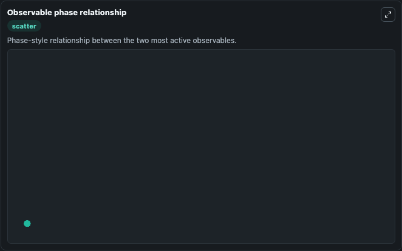

# Thiaville2016 - Folate pathway model (PanB overexpression and THF regulation)

Cleaned metabolism SBML ODE lab. The bundled SBML file remains the scientific source of truth.

Validation evidence: Tellurium loaded and simulated 7 floating species

## What You'll See

These dark-mode screenshots show the default Thiaville2016 - Folate pathway model (PanB overexpression and THF regulation) run over 10 model-time units with outputs sampled every 1. The lab exposes 5 inputs (`initial_folate_metabolism_state_1`, `initial_folate_metabolism_state_2`, `initial_para_aminobenzoate`, `initial_folate_metabolism_state_4`, `initial_dihydrofolate`) and 8 outputs (`folate_metabolism_state_1`, `folate_metabolism_state_2`, `para_aminobenzoate`, `folate_metabolism_state_4`, `dihydrofolate`, and 3 more). The default input state includes `initial_folate_metabolism_state_1`=`0.000003315`, `initial_folate_metabolism_state_2`=`0.00001`, `initial_para_aminobenzoate`=`0.00001`, `initial_folate_metabolism_state_4`=`0.00001`. Henry2016 Folate pathway model with inducedPanB reaction This model is described in the article: Experimental and Metabolic Modeling Evidence for a Folate-Cleaving Side-Activity of Ketopantoate Hydrox. It can be used to explore metabolic flux dynamics and compare pathway behavior across conditions.

<!-- BIOSIMULANT_VISUALS_START -->
### Output Visualizations

The run interpretation table summarizes the configured Thiaville2016 - Folate pathway model (PanB overexpression and THF regulation) simulation and its reported output statistics.

The observable dynamics plot traces the main reported outputs over the captured run window, including `folate_metabolism_state_1`, `folate_metabolism_state_2`, `para_aminobenzoate`, `folate_metabolism_state_4`, and 4 more.

The largest-observable-excursions chart ranks which reported variables moved the most during this simulation.

The phase-relationship plot compares paired observable values to show how the dominant trajectories move relative to one another.

<!-- BIOSIMULANT_VISUALS_END -->
