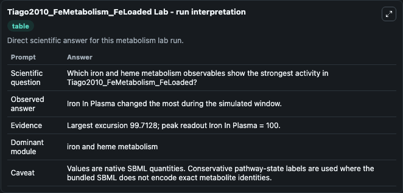
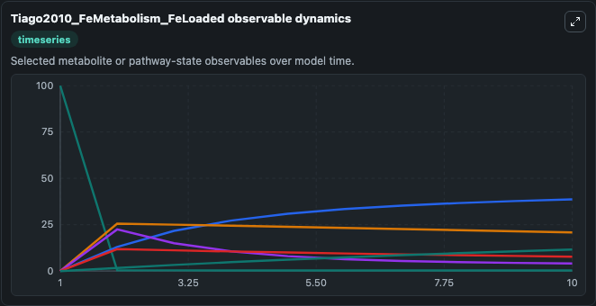
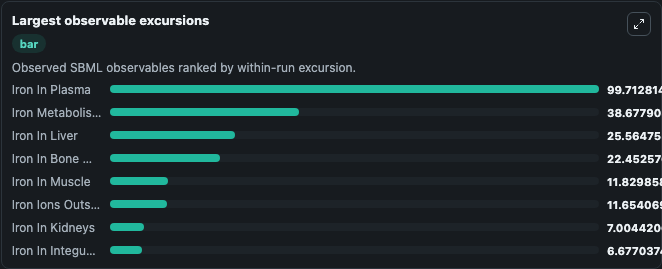
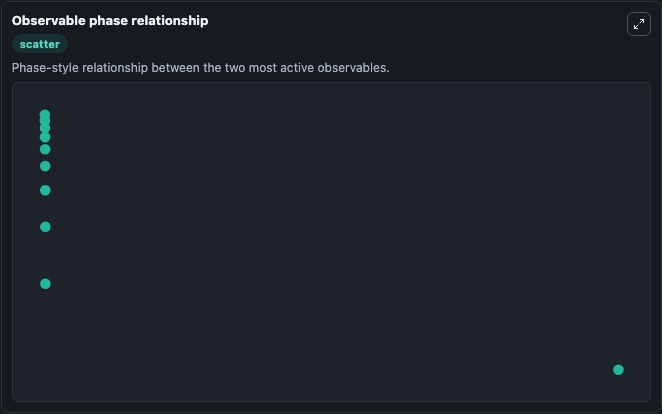

# Tiago2010_FeMetabolism_FeLoaded

Cleaned metabolism SBML ODE lab. The bundled SBML file remains the scientific source of truth.

Validation evidence: Tellurium loaded and simulated 17 floating species

## What You'll See

These dark-mode screenshots show the default Tiago2010_FeMetabolism_FeLoaded run over 10 model-time units with outputs sampled every 1. The lab exposes 5 inputs (`initial_iron_in_plasma`, `initial_iron_in_bone_marrow`, `initial_iron_metabolism_state_3`, `initial_iron_in_spleen`, `initial_iron_in_liver`) and 8 outputs (`iron_in_plasma`, `iron_in_bone_marrow`, `iron_metabolism_state_3`, `iron_in_spleen`, `iron_in_liver`, and 3 more). The default input state includes `initial_iron_in_plasma`=`100`, `initial_iron_in_bone_marrow`=`0`, `initial_iron_metabolism_state_3`=`0`, `initial_iron_in_spleen`=`0`. This a model from the article: Systems analysis of iron metabolism: the network of iron pools and fluxes Tiago JS Lopes, Tatyana Luganskaja, Maja Vujic-Spasic, Matthias W Hentze, Martina U Muckenthale. It can be used to explore metabolic flux dynamics and compare pathway behavior across conditions.

<!-- BIOSIMULANT_VISUALS_START -->
### Output Visualizations

The run interpretation table summarizes the configured Tiago2010_FeMetabolism_FeLoaded simulation and its reported output statistics.

The observable dynamics plot traces the main reported outputs over the captured run window, including `iron_in_plasma`, `iron_in_bone_marrow`, `iron_metabolism_state_3`, `iron_in_spleen`, and 4 more.

The largest-observable-excursions chart ranks which reported variables moved the most during this simulation.

The phase-relationship plot compares paired observable values to show how the dominant trajectories move relative to one another.

<!-- BIOSIMULANT_VISUALS_END -->
