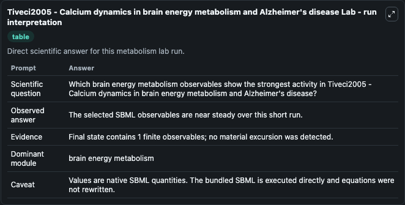
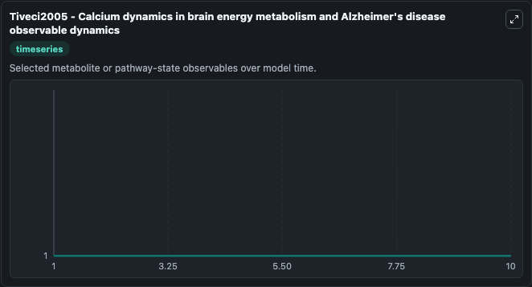
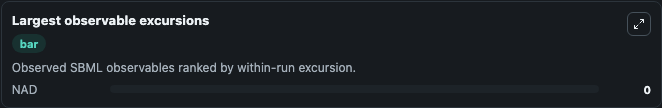

# Tiveci2005 - Calcium dynamics in brain energy metabolism and Alzheimer's disease

Cleaned metabolism SBML ODE lab. The bundled SBML file remains the scientific source of truth.

Validation evidence: Tellurium loaded and simulated 1 floating species

## What You'll See

These dark-mode screenshots show the default Tiveci2005 - Calcium dynamics in brain energy metabolism and Alzheimer's disease run over 10 model-time units with outputs sampled every 1. The lab exposes 1 input (`initial_nad`) and 4 outputs (`nad`, `observable_values`, `run_summary`, `observable_labels`). The default input state includes `initial_nad`=`1`. Tiveci2005 - Calcium dynamics in brain energymetabolism and Alzheimer's disease Encoded non-curated model. Issues: - Missing values: dHb,0 ; α ; V ; γ ; Volume ; rc ;V leak,mem,Ca ; V Ca,Pump,ER ; V c.

<!-- BIOSIMULANT_VISUALS_START -->
### Output Visualizations

The run interpretation table summarizes the configured Tiveci2005 - Calcium dynamics in brain energy metabolism and Alzheimer's disease simulation and its reported output statistics.

The observable dynamics plot traces the main reported outputs over the captured run window, including `nad`, `observable_values`, `run_summary`, `observable_labels`.

The largest-observable-excursions chart ranks which reported variables moved the most during this simulation.

<!-- BIOSIMULANT_VISUALS_END -->
