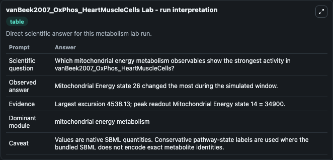
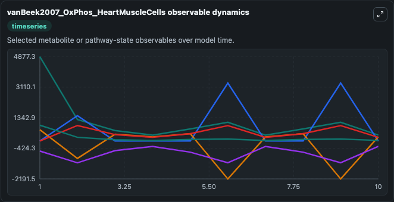
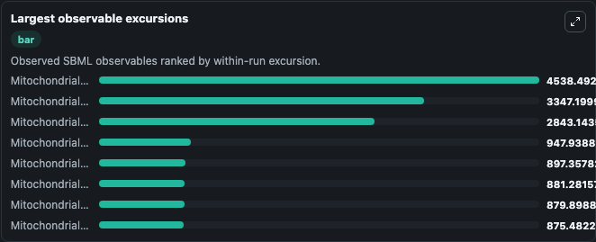
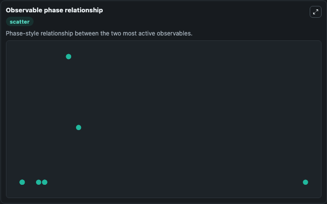

# vanBeek2007_OxPhos_HeartMuscleCells

Cleaned metabolism SBML ODE lab. The bundled SBML file remains the scientific source of truth.

Validation evidence: Tellurium loaded and simulated 20 floating species

## What You'll See

These dark-mode screenshots show the default vanBeek2007_OxPhos_HeartMuscleCells run over 10 model-time units with outputs sampled every 1. The lab exposes 5 inputs (`initial_cytosolic_atp`, `initial_cytosolic_adp`, `initial_mitochondrial_energy_state_3_cytosolic`, `initial_mitochondrial_energy_state_4_cytosolic`, `initial_mitochondrial_energy_state_5_cytosolic`) and 8 outputs (`cytosolic_atp`, `cytosolic_adp`, `mitochondrial_energy_state_3_cytosolic`, `mitochondrial_energy_state_4_cytosolic`, `mitochondrial_energy_state_5_cytosolic`, and 3 more). The default input state includes `initial_cytosolic_atp`=`5912.77`, `initial_cytosolic_adp`=`64`, `initial_mitochondrial_energy_state_3_cytosolic`=`5000`, `initial_mitochondrial_energy_state_4_cytosolic`=`10500`. This a model from the article: Adenine nucleotide-creatine-phosphate module in myocardial metabolic systemexplains fast phase of dynamic regulation of oxidative phosphorylation. It can be used to explore metabolic flux dynamics and compare pathway behavior across conditions.

<!-- BIOSIMULANT_VISUALS_START -->
### Output Visualizations

The run interpretation table summarizes the configured vanBeek2007_OxPhos_HeartMuscleCells simulation and its reported output statistics.

The observable dynamics plot traces the main reported outputs over the captured run window, including `cytosolic_atp`, `cytosolic_adp`, `mitochondrial_energy_state_3_cytosolic`, `mitochondrial_energy_state_4_cytosolic`, and 4 more.

The largest-observable-excursions chart ranks which reported variables moved the most during this simulation.

The phase-relationship plot compares paired observable values to show how the dominant trajectories move relative to one another.

<!-- BIOSIMULANT_VISUALS_END -->
