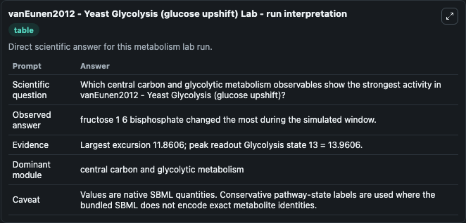
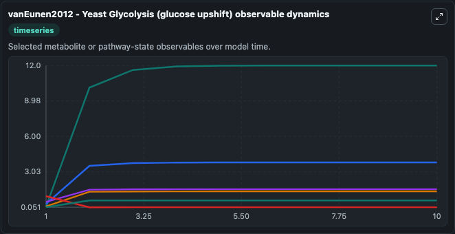
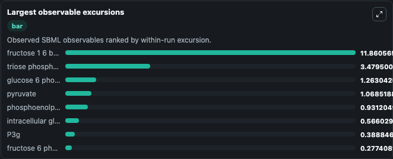
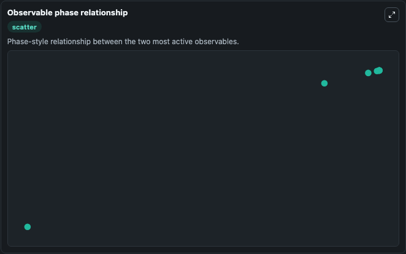

# vanEunen2012 - Yeast Glycolysis (glucose upshift)

Cleaned metabolism SBML ODE lab. The bundled SBML file remains the scientific source of truth.

Validation evidence: Tellurium loaded and simulated 13 floating species

## What You'll See

These dark-mode screenshots show the default vanEunen2012 - Yeast Glycolysis (glucose upshift) run over 10 model-time units with outputs sampled every 1. The lab exposes 5 inputs (`initial_intracellular_glucose`, `initial_glucose_6_phosphate`, `initial_fructose_6_phosphate`, `initial_fructose_1_6_bisphosphate`, `initial_triose_phosphate`) and 8 outputs (`intracellular_glucose`, `glucose_6_phosphate`, `fructose_6_phosphate`, `fructose_1_6_bisphosphate`, `triose_phosphate`, and 3 more). The default input state includes `initial_intracellular_glucose`=`0.0576023`, `initial_glucose_6_phosphate`=`0.121566`, `initial_fructose_6_phosphate`=`0.0263653`, `initial_fructose_1_6_bisphosphate`=`0.0928847`. This is corresponding to the model of yeast glycolysis 'glucose upshift' condition described in the paper 'Testing Biochemistry Revisited: How In Vivo Metabolism Can Be Understood from In Vitro Enzyme. It can be used to explore metabolic flux dynamics and compare pathway behavior across conditions.

<!-- BIOSIMULANT_VISUALS_START -->
### Output Visualizations

The run interpretation table summarizes the configured vanEunen2012 - Yeast Glycolysis (glucose upshift) simulation and its reported output statistics.

The observable dynamics plot traces the main reported outputs over the captured run window, including `intracellular_glucose`, `glucose_6_phosphate`, `fructose_6_phosphate`, `fructose_1_6_bisphosphate`, and 4 more.

The largest-observable-excursions chart ranks which reported variables moved the most during this simulation.

The phase-relationship plot compares paired observable values to show how the dominant trajectories move relative to one another.

<!-- BIOSIMULANT_VISUALS_END -->
