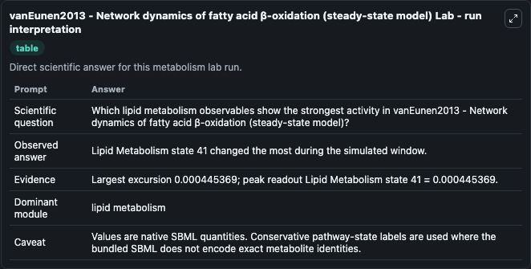
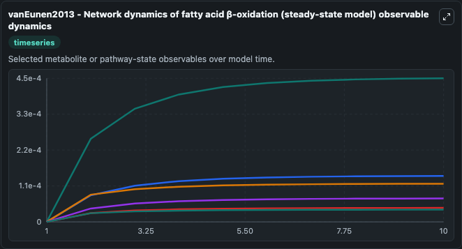
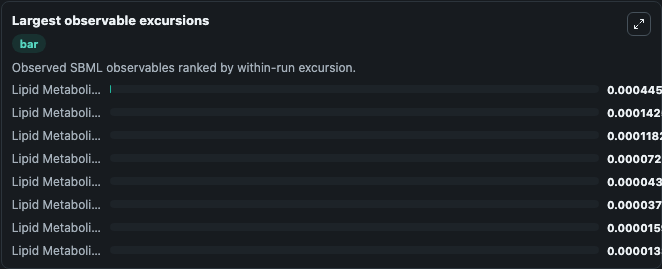
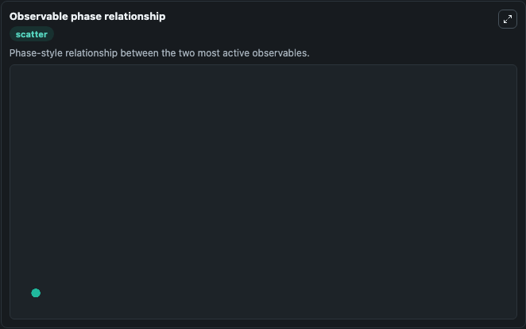

# vanEunen2013 - Network dynamics of fatty acid β-oxidation (steady-state model)

Cleaned metabolism SBML ODE lab. The bundled SBML file remains the scientific source of truth.

Validation evidence: Tellurium loaded and simulated 45 floating species

## What You'll See

These dark-mode screenshots show the default vanEunen2013 - Network dynamics of fatty acid β-oxidation (steady-state model) run over 10 model-time units with outputs sampled every 1. The lab exposes 5 inputs (`initial_lipid_metabolism_state_1_cytosolic`, `initial_lipid_metabolism_state_2_mitochondrial`, `initial_lipid_metabolism_state_3`, `initial_lipid_metabolism_state_4`, `initial_lipid_metabolism_state_5`) and 8 outputs (`lipid_metabolism_state_1_cytosolic`, `lipid_metabolism_state_2_mitochondrial`, `lipid_metabolism_state_3`, `lipid_metabolism_state_4`, `lipid_metabolism_state_5`, and 3 more). The default input state includes `initial_lipid_metabolism_state_1_cytosolic`=`0`, `initial_lipid_metabolism_state_2_mitochondrial`=`0`, `initial_lipid_metabolism_state_3`=`0`, `initial_lipid_metabolism_state_4`=`0`. vanEunen2013 - Network dynamics of fatty acid β-oxidation (steady-state model) Lipid metabolism plays an important role in the development of metabolic syndrome, a major risk factor for cardiovascular. It can be used to explore metabolic flux dynamics and compare pathway behavior across conditions.

<!-- BIOSIMULANT_VISUALS_START -->
### Output Visualizations

The run interpretation table summarizes the configured vanEunen2013 - Network dynamics of fatty acid β-oxidation (steady-state model) simulation and its reported output statistics.

The observable dynamics plot traces the main reported outputs over the captured run window, including `lipid_metabolism_state_1_cytosolic`, `lipid_metabolism_state_2_mitochondrial`, `lipid_metabolism_state_3`, `lipid_metabolism_state_4`, and 4 more.

The largest-observable-excursions chart ranks which reported variables moved the most during this simulation.

The phase-relationship plot compares paired observable values to show how the dominant trajectories move relative to one another.

<!-- BIOSIMULANT_VISUALS_END -->
