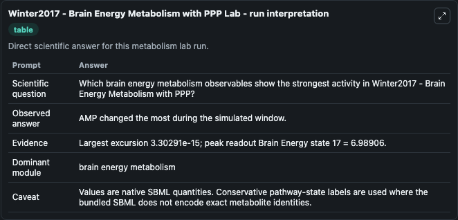
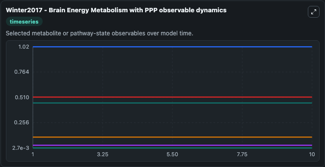
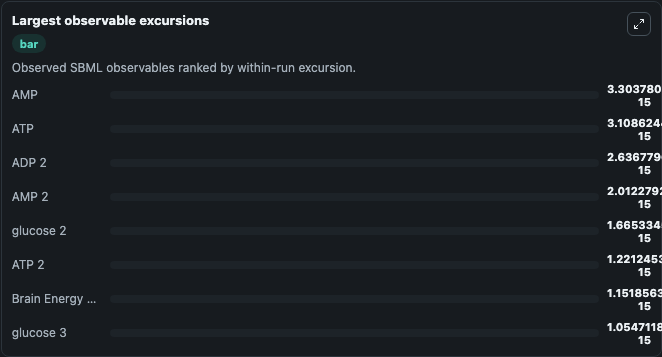

# Winter2017 - Brain Energy Metabolism with PPP

Cleaned metabolism SBML ODE lab. The bundled SBML file remains the scientific source of truth.

Validation evidence: Tellurium loaded and simulated 60 floating species

## What You'll See

These dark-mode screenshots show the default Winter2017 - Brain Energy Metabolism with PPP run over 10 model-time units with outputs sampled every 1. The lab exposes 5 inputs (`initial_brain_energy_state_1`, `initial_co2`, `initial_glucose`, `initial_lactate`, `initial_brain_energy_state_5`) and 8 outputs (`brain_energy_state_1`, `co2`, `glucose`, `lactate`, `brain_energy_state_5`, and 3 more). The default input state includes `initial_brain_energy_state_1`=`0.040323291746644`, `initial_co2`=`0.0121467082533562`, `initial_glucose`=`0.0253903826849856`, `initial_lactate`=`0.00188912996259375`. Winter2017 - Brain Energy Metabolism with PPP This model is described in the article: Mathematical analysis of the influence of brain metabolism on the BOLD signal in Alzheimer's disease Felix Winter1. It can be used to explore metabolic flux dynamics and compare pathway behavior across conditions.

<!-- BIOSIMULANT_VISUALS_START -->
### Output Visualizations

The run interpretation table summarizes the configured Winter2017 - Brain Energy Metabolism with PPP simulation and its reported output statistics.

The observable dynamics plot traces the main reported outputs over the captured run window, including `brain_energy_state_1`, `co2`, `glucose`, `lactate`, and 4 more.

The largest-observable-excursions chart ranks which reported variables moved the most during this simulation.

The phase-relationship plot compares paired observable values to show how the dominant trajectories move relative to one another.

<!-- BIOSIMULANT_VISUALS_END -->
